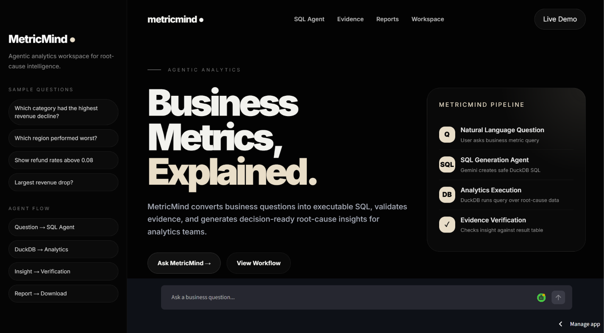
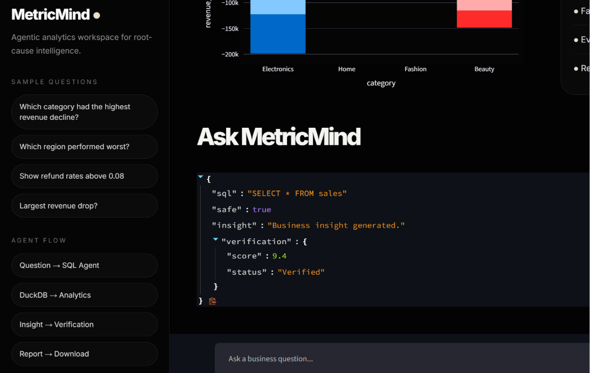
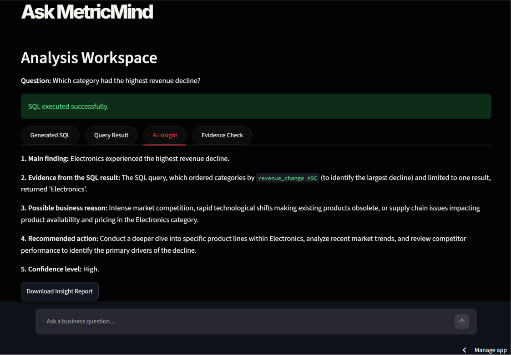
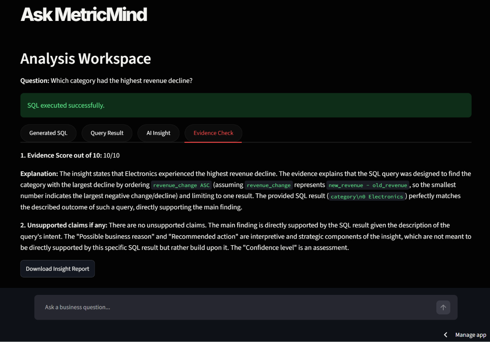

# MetricMind: Agentic Root-Cause Analytics Engine

MetricMind is an AI-native analytics system that investigates why a business metric changed. It uses SQL-backed analysis, root-cause detection, Gemini-powered insight generation, and an evaluator agent to produce evidence-checked business recommendations.

## Live Demo
[Launch MetricMind](https://metricmind-agentic-root-cause-analyticsgit-itkmydzjdeka3nlfhcy.streamlit.app/)

## Agent Architecture

MetricMind uses modular agents for SQL generation, failure detection, insight generation and evidence verification.

## Architecture

```text
User Question
    ↓
SQL Generation Agent
    ↓
Failure Detection Agent
    ↓
DuckDB Analytics Engine
    ↓
Insight Generation Agent
    ↓
Evidence Verification Agent
    ↓
Business Report
```

## Screenshots

### Landing Page


### SQL Generation


### Insight Generation


### Evidence Verification


## Problem Statement

Traditional dashboards tell users what happened, but not why it happened.

MetricMind enables users to ask natural-language business questions and automatically performs SQL analysis, root-cause detection, evidence verification, and insight generation.

## Key Features

- Natural Language → SQL Generation
- Automated Root-Cause Analysis
- DuckDB-Based Query Execution
- Failure Detection for Unsafe Queries
- AI-Generated Business Insights
- Evidence Verification Agent
- Interactive Visualizations
- Downloadable Analytics Reports

## Tech Stack

| Layer | Technology |
|---------|------------|
| Frontend | Streamlit |
| Analytics Engine | DuckDB |
| LLM | Gemini 2.5 Flash |
| Data Processing | Pandas |
| Visualization | Plotly |
| Language | Python |

## Problem Statement

Business dashboards explain **what happened**, but rarely explain **why it happened**. Analysts still spend significant time writing SQL queries, investigating root causes, and validating conclusions manually.

MetricMind automates this workflow through an AI-powered analytics pipeline that converts business questions into SQL, executes analysis, generates insights, and verifies evidence before reporting results.

---

## Key Features

* Natural Language → SQL Generation
* Agent-Based Analytics Pipeline
* DuckDB Query Execution Engine
* Unsafe Query Detection
* Evidence-Backed Insight Generation
* Automated Verification Layer
* Interactive Visual Analytics
* Downloadable Analysis Reports

---

## Architecture

User Question
↓
SQL Agent
↓
Failure Detection Agent
↓
DuckDB Analytics Engine
↓
Insight Generation Agent
↓
Evidence Verification Agent
↓
Business Report

---

## Tech Stack

| Component        | Technology       |
| ---------------- | ---------------- |
| Frontend         | Streamlit        |
| LLM              | Gemini 2.5 Flash |
| Analytics Engine | DuckDB           |
| Data Processing  | Pandas           |
| Visualization    | Plotly           |
| Language         | Python           |

---

## Example Queries

* Which category had the highest revenue decline?
* Which region contributed most to revenue loss?
* Show categories with refund rates above 0.08.
* Which business segment caused the largest revenue drop?
* Which category recovered despite elevated refunds?

---

## Results

* Converts business questions into executable SQL automatically.
* Executes analytical workflows without manual query writing.
* Generates evidence-backed business insights.
* Detects potentially unsafe SQL operations.
* Verifies analytical conclusions before reporting.
* Produces decision-ready analytics reports.

---

## Future Improvements

* Multi-step Agent Orchestration
* Conversational Analytics Memory
* Automated PDF Report Generation
* Multi-Dataset Support
* Real-Time Business Monitoring


